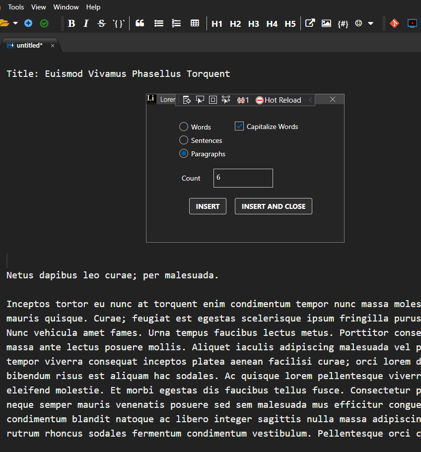

Text Generator is an addin for [MarkdownMonster](https://markdownmonster.west-wind.com/) which generates random text using an implementation of Lorem Ipsum. You can read about Lorem Ipsum [here](https://lipsum.com/). Note, the text generator and the one at lipsum.com are different implementations, the author is not associated with lipsum.com in any way.

Text Generator makes use of two libraries: "sharp-random" and "Lorem-Ipsum". These are open source but have not been made public due to the lack of any documentation, and other nastyness.

